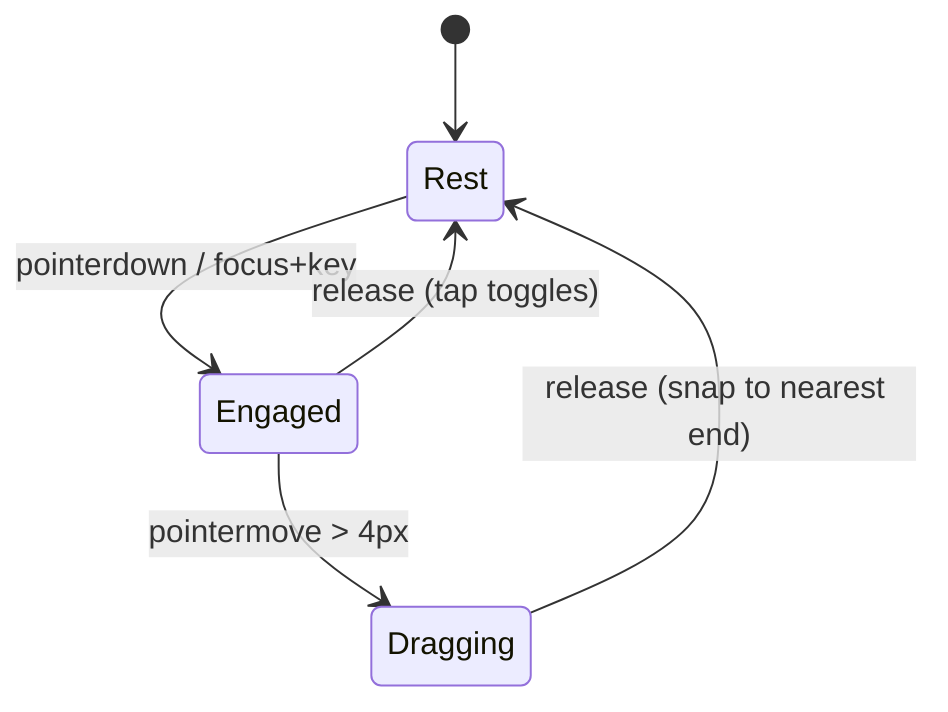

# Liquid Glass — Motion design spec

> The motion half of the design library. Where [design-spec.md](design-spec.md)
> governs how glass **looks**, this governs how it **moves**. Motion is a
> first-class, tokenized subsystem — not per-component animation — so every
> control feels like the same material and the whole library can be retuned from
> one place. This is the detailed form of principle **LG-P8**.

---

## 1. Goal

The recreated demos (Switch, Slider, Precision Lens, Music Player) are not just
visual clones — each carries a precise, physics-driven motion design: a knob that
turns from opaque plastic into glass as you grab it, a thumb that scales up and
refracts harder while dragging, a lens that squashes and stretches with drag
velocity and settles like jelly. Those behaviours are **library assets**, exactly
like a color ramp or the surface palette.

This spec captures that motion language once, as:

1. a small set of **named spring families** (the physics vocabulary),
2. one shared **activation transition** (the resting → engaged feel),
3. a few **velocity / elastic** rules (squash-and-stretch, rubber-band),

all expressed as **tokens** in [`tokens/motion.css`](../../packages/ui/tokens/motion.css),
driven by one runtime ([`behaviors/springs.js`](../../packages/ui/behaviors/springs.js)),
and **controllable together** for the whole library via a single dial and a closed
set of presets.

---

## 2. Principles (motion)

- **MO-1 — Physics, not keyframes.** Interactive motion is a spring simulation
  (`{stiffness, damping, mass}`), not a timed `@keyframes`. State changes set a
  *target*; the spring resolves the path. Discrete, non-interactive transitions
  (hover tint, focus ring) may still use duration + easing tokens.
- **MO-2 — Named families, chosen by name.** A component never writes a raw
  stiffness/damping pair. It selects a **spring family** by name (`snap`,
  `glide`, …) — a closed catalog, exactly like the surface palette (LG-P13).
- **MO-3 — One activation transition.** Every interactive glass control engages
  the same way (opaque → glass, refraction boost, lift), from shared tokens, so
  the whole library "turns to glass" with one identity.
- **MO-4 — Controlled together.** All motion scales off one dial
  (`--lg-motion-scale`) and a closed set of presets (`[data-lg-motion]`). A host
  retunes the entire library's character without touching a component.
- **MO-5 — Reduced motion is a token concern.** `prefers-reduced-motion` collapses
  durations to `0ms` and flips `--lg-motion-reduce`, which makes the runtime
  *jump* springs to target. No component branches on motion.

---

## 3. The activation transition (the signature)

Every interactive glass control shares one gesture: at rest it reads as a solid,
slightly inset object; the moment it is **engaged** (pressed, grabbed, or
`force-active`) it *crystallizes into glass* — the body turns translucent,
refraction intensifies, and it lifts off the surface. This single transition is
what makes the Switch knob, Slider thumb, and Lens feel like the same material.

Let the engaged state be $s \in \{0, 1\}$ (or a continuous blend during a drag).
Each property springs from its **rest** endpoint to its **active** endpoint:

| Property | Rest → Active | Token (rest / active) | Spring family |
| --- | --- | --- | --- |
| Body opacity (material → glass) | `1` → `0.1` | `--lg-motion-glass-alpha-rest` / `-active` | `snap` |
| Scale (presence) | per-control¹ | instance dims (LG-P2) | `snap` |
| Refraction (× material) | `0.4` → `0.9` | `--lg-motion-refraction-rest` / `-active` | `settle` |
| Lift (shadow offset/blur/alpha + inset bevel) | rest → lifted | `--lg-shadow-*` + inset | `grab` / `jelly` |

¹ The travel of scale is an **instance dimension** (a knob goes `0.65 → 0.9`, a
thumb `0.6 → 1.0`, the lens `0.8 → 1.0`) and is declared on the component with a
justifying comment (LG-P2). The *endpoints that carry identity* — the opaque→glass
alpha and the refraction floor/ceiling — are shared tokens.

```js
// The reusable shape (see behaviors/springs.js → activation()):
//   alpha       = lerp(glassAlphaRest, glassAlphaActive, s)   // snap
//   refraction  = lerp(refractionRest, refractionActive, s) * userRefraction // settle
//   scale       = lerp(scaleRest,      scaleActive,      s)   // snap  (instance endpoints)
```

---

## 4. Spring family catalog

A **closed** catalog of `{stiffness, damping}` roles, harvested from the demos.
Components pick a family by name; new families are added by governance, never
invented at a call site (MO-2 / LG-P13). Mass defaults to `1`.

| Family | Stiffness / Damping | Character | Drives (from the demos) |
| --- | --- | --- | --- |
| `snap` | 2000 / 80 | crisp, barely-overshooting | knob & thumb **scale** and **opacity** (material response) |
| `glide` | 1000 / 80 | smooth travel | switch **position**, track **colour** blend |
| `settle` | 170 / 26 | soft ease | **refraction** level easing in/out |
| `grab` | 250 / 14 | bouncy | lens **lift** + **magnification** on grab |
| `jelly` | 340 / 20 | springy wobble | lens **squash/stretch** + lifting shadow |
| `damp` | 220 / 24 | slow opacity settle | shadow / inset **alpha** |

Tokens: `--lg-motion-spring-{family}-stiffness` and `-damping`. The legacy names
`knob` (= `snap`) and `lens` (= `jelly`) remain as aliases.

The underlying model is a damped harmonic oscillator integrated with semi-implicit
Euler at a fixed sub-step:

$$ \ddot{x} = \frac{-k\,(x - x_{\text{target}}) - c\,\dot{x}}{m} $$

with rest detected when both $|\dot{x}|$ and $|x - x_{\text{target}}|$ fall below
small thresholds (the runtime then snaps to target and stops the RAF loop).

---

## 5. Velocity & elasticity

Two interaction flourishes from the demos are generalized into tokenized rules.

### 5.1 Squash-and-stretch (drag velocity → shape)

While dragging, horizontal velocity $v_x$ (px/s) squashes the control vertically
and stretches it horizontally, conserving rough area — the Lens "jelly" wobble:

$$ \text{scaleY} = s \cdot \max\!\left(\text{floor},\ 1 - \frac{|v_x|}{V}\right),
\qquad \text{scaleX} = s + (1 - \text{scaleY}) $$

| Symbol | Token | Default |
| --- | --- | --- |
| $V$ — velocity that maps to full squash | `--lg-motion-squash-velocity` | `5000` |
| floor — minimum scaleY under fastest drag | `--lg-motion-squash-floor` | `0.7` |
| velocity decay per frame when the pointer holds still | `--lg-motion-velocity-relax` | `0.8` |

Both axes are driven through the `jelly` family so the shape *settles* rather than
snapping back.

### 5.2 Rubber-band overshoot (elastic ends)

When a drag pushes past a track end by $d$ (in normalized units), the control
follows with diminishing return instead of stopping dead:

$$ \text{position} = \text{clamp}_{01}(p) \pm \frac{\text{overshoot}}{R},
\qquad R = \texttt{--lg-motion-rubber-band}\ (=22) $$

On release, the value **snaps** to the nearest end (discrete decision), or — for a
tap with no drag — **toggles**.

---

## 6. State-machine recipes

The demos compose the families + activation into small, reusable state machines.
These are the canonical patterns a `behaviors/{name}.js` controller implements.

**Switch** — `S = forced || grabbing`:

| Motion value | Family | Rest → Active |
| --- | --- | --- |
| position `0..1` | `glide` | follows drag `h`, else target `f` |
| knob opacity | `snap` | `1 → 0.1` (opaque → glass) |
| knob scale | `snap` | `0.65 → 0.9` |
| track colour | `glide` | gray → green |
| refraction | `settle` | `(0.4 → 0.9) · userRefraction` |

Drag adds rubber-band overshoot (§5.2); release snaps to the nearest end; a tap
toggles; Space/Enter toggles; `force-active` pins `S = 1`.



**Slider** — same activation (`snap` scale `0.6→1.0`, `snap` opacity `1→0.1`,
`settle` refraction); thumb drags from itself or anywhere on the track, centre
clamped a fixed pad from each end.

**Lens** — pure activation + §5.1 squash: `grab` drives lift + magnification,
`jelly` drives scaleX/scaleY and the lifting shadow, `damp` settles shadow/inset
alpha.

---

## 7. Tokenization & global control

Everything above is tokens in [`tokens/motion.css`](../../packages/ui/tokens/motion.css),
and the whole library is retuned from **one place**:

- **`--lg-motion-scale`** (default `1`) multiplies every duration via `calc()`.
- **`[data-lg-motion]`** on the root selects a **closed set** of presets that
  retune `--lg-motion-scale` *and* the spring families together:

  | Preset | Feel | Effect |
  | --- | --- | --- |
  | (default) | reference kube.io | as harvested |
  | `calm` | softer, slower | longer durations, lower stiffness |
  | `crisp` | snappier | shorter durations, higher stiffness |

The preset set is enumerated in
[`library.manifest.json`](../../packages/ui/library.manifest.json) → `motion`,
the authoritative list (a host UI can offer exactly these). Adding a preset or a
spring family is a manifest-versioned act of governance (LG-P13), not a call-site
change.

---

## 8. The physics runtime

One tiny, framework-free runtime ships the motion:
[`behaviors/springs.js`](../../packages/ui/behaviors/springs.js).

- `Spring(value, { stiffness, damping, mass })` — the oscillator (§4), with
  `set(target)`, `jump(value)`, `onChange(cb)`, and self-stopping RAF.
- `readSpring(family, root?)` — resolves a named family to its `{stiffness,
  damping}` from the motion tokens (one `getComputedStyle` read).
- `createSpring(family, value, root?)` — a token-bound spring that also honours
  reduced motion: when `--lg-motion-reduce` is `1`, `set()` **jumps**.
- `activation(root?)` — reads the activation endpoints so a behavior can build the
  shared resting → engaged transition without hard-coding values.

Behaviors (LG-P12) own all interaction and import this runtime; factories stay
inert and SSR-safe. The runtime reads tokens at attach time, so presets,
reduced-motion, and density all flow through automatically.

---

## 9. Reduced motion & accessibility

- `@media (prefers-reduced-motion: reduce)` sets `--lg-motion-scale: 0` (durations
  → `0ms`) and `--lg-motion-reduce: 1` (springs jump to target). Controls still
  reach every state instantly and correctly; only the animated path is removed.
- Motion never conveys state on its own — the same ARIA state changes
  (`aria-checked`, `aria-valuenow`) fire regardless of whether motion plays.
- Spring loops stop at rest (no idle RAF), and the count of simultaneously
  animating glass surfaces is capped (LG-P11) so motion never threatens frame rate.

---

## 10. Anti-patterns

- A component or behavior hard-coding a `{stiffness, damping}` pair instead of a
  named family.
- A `@keyframes` / CSS `transition` for an interactive, stateful motion that
  should be a spring (MO-1).
- Inventing a per-control activation feel (different opaque→glass alpha or
  refraction floor) instead of the shared tokens (MO-3).
- Branching on `prefers-reduced-motion` inside a component instead of letting the
  tokens + runtime handle it (MO-5).
- A new one-off spring family or motion preset added at a call site rather than to
  the catalog + manifest (MO-2 / LG-P13).

---

## 11. Scalability & open questions

- **Per-family mass.** Today mass is fixed at `1`; if a future component needs
  weightier motion, add `--lg-motion-spring-{family}-mass` rather than a bespoke
  spring.
- **Continuous vs. discrete activation.** The model supports a continuous engaged
  blend `s ∈ [0,1]` (used mid-drag) and a binary one; both read the same tokens.
- **Motion-scale and spring speed.** `--lg-motion-scale` multiplies durations
  exactly; spring "speed" is retuned by the presets (stiffness), since spring
  settling time is not linear in a single multiplier. If a precise global spring
  speed dial is needed, the runtime can scale stiffness by `--lg-motion-scale²`
  at read time — deferred until a real need appears.
- **Theming motion.** Presets are global today; per-subtree motion (a `calm`
  dialog inside a `crisp` app) works because presets are attribute-scoped CSS, but
  the runtime must read tokens from the *attached node's* root, not
  `documentElement` — noted for the behavior implementations.
